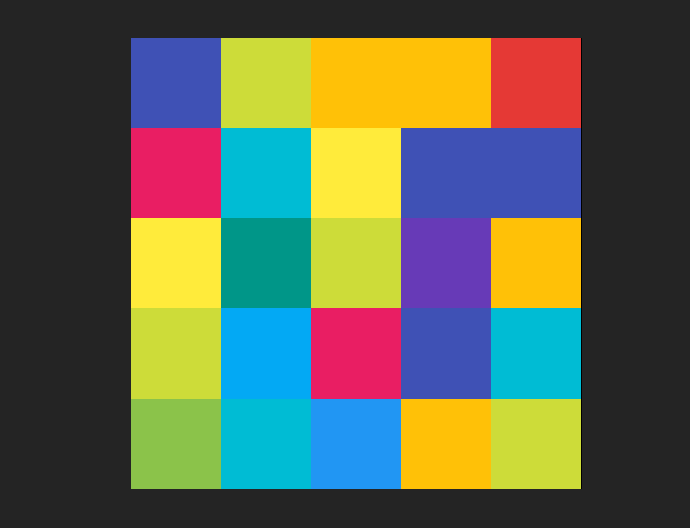

# Color box

A simple and fun React app with a box that changes to a random color when clicked

## 🖼️ Preview



## 🛠️ Getting Started

### Prerequisites

- [Node.js](https://nodejs.org/) (v16 or higher recommended)
- [npm](https://www.npmjs.com/) or [yarn](https://yarnpkg.com/)

### Installation

1. **Clone the repository:**
   ```bash
   git clone <repo-url>
   cd color-box
   ```
2. **Install dependencies:**
   ```bash
   npm install
   ```

### Running the App

- **Development mode:**

  ```bash
  npm run dev
  ```

  The app will be available at [http://localhost:5173](http://localhost:5173) (or as shown in your terminal).

- **Production build:**

  ```bash
  npm run build
  ```

- **Preview production build:**
  ```bash
  npm run preview
  ```

## 🙋 **Author & Contact**

**Author:** Magesh Balram

📧 **Email:** [mageshbalram@gmail.com](mailto:mageshbalram@gmail.com)
